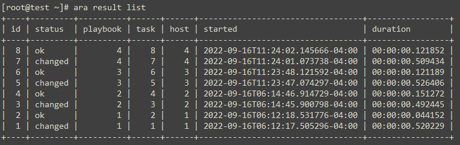

<!-- PROJECT LOGO -->
<br />
<div align="center">
  <h3 align="center">Ansible reporting with ARA: Ansible Run Analysis</h3>
  <p align="center">
    Detailed analysis of the Ansible playbook runs
</div>

<!-- TABLE OF CONTENTS -->
<details>
  <summary>Table of Contents</summary>
  <ol>
    <li>
      <a href="#about-the-project">About The Project</a>
    </li>
    <li>
      <a href="#prerequisites">Prerequisites</a>
      <ul>
        <li><a href="#sqlite">SQLite 3.8</a></li>
        <li><a href="#python">Python 3.8</a></li>
      </ul>
    </li>
    <li><a href="#recording_playbooks">Recording playbooks</a></li>
  </ol>
</details>

## About The Project

For RHEL 7 and CentOS 7 it is recommended to install python3.8 due to missing or outdated dependencies. 
It provides you with a detailed analysis of your Ansible playbook runs, which includes:
•	Tasks description, status and output
•	Play description and duration
•	Hosts involved
•	Files executed
•	Parameters used

Use the `README.md` to get started.

<p align="right">(<a href="#readme-top">back to top</a>)</p>

## Prerequisites

### SQLite 3.8

#### Upgrading SQLite on CentOS 7 to 3.8.3 or Later
Download the source code from https://www.sqlite.org/download.html
* sqlite
  ```sh
  cd /opt
  wget --no-check-certificate https://www.sqlite.org/2022/sqlite-autoconf-3390300.tar.gz
  ```
* Extract File
   ```sh
  tar -xvf sqlite-autoconf-3390300.tar.gz
  cd sqlite-autoconf-3390300
  ```
 * Compile
    ```sh
   ./configure
   make
   make install
   echo “export LD_LIBRARY_PATH=/usr/local/lib” >> /root/.bashrc
   ```
 Checking SQlite3 version quickly
   ```sh
  python3.8 -c "import sqlite3; print(sqlite3.sqlite_version)"
  ```
### Python 3.8
  #### Upgrading Python on CentOS 7 to 3.8
  * Install Python Dependencies
    ```sh
    yum -y install epel-release
    ```
  * install build dependencies
     ```sh
    yum -y groupinstall "Development Tools"
    yum -y install openssl-devel bzip2-devel libffi-devel xz-devel
    ```
  * Confirm gcc is available
      ```sh
    gcc –version
    ```
    `gcc (GCC) 4.8.5 20150623 (Red Hat 4.8.5-44)
    Copyright (C) 2015 Free Software Foundation, Inc.
    This is free software; see the source for copying conditions.  There is NO
    warranty; not even for MERCHANTABILITY or FITNESS FOR A PARTICULAR PURPOSE.`

  * Download latest Python 3.8 Archive
      ```sh
    wget https://www.python.org/ftp/python/3.8.12/Python-3.8.12.tgz
    ```
  * Extract the package
      ```sh
    tar xvf Python-3.8.12.tgz
    ```
  * Change the created directory
      ```sh
    cd Python-3.8*/
    ```
  * Setup installation by running the configure script
      ```sh
    ./configure --enable-optimizations
    ```
  * Compilation of Python 3.8
      ```sh
    make
    make install
    ```
  * Check Python 3.8
      ```sh
    python3.8 --version
    ```
    `Python 3.8.12`
    
   * Check Pip 3.8
      ```sh
     pip3.8 –version
     ```
     `pip 21.1.1 from /usr/local/lib/python3.8/site-packages/pip (python 3.8)`
    
  ## Recording Playbooks
  ### Environement definition
  * Create environement
       ```sh
     python3.8 -m venv /opt/virtualenv38/
     source /opt/virtualenv38/bin/activate
     ```
   * Upgrade pip
      ```sh
     pip install --upgrade pip
     ```
   * Install Ansible and ARA (with API server dependencies) for the current user
       ```sh
     pip3.8 install ansible ara[server]
     ```
   * Configure Ansible to use the ARA callback plugin
       ```sh
     export ANSIBLE_CALLBACK_PLUGINS="$(python3.8 -m ara.setup.callback_plugins)"
     ```
   * Run an Ansible playbook
       ```sh
     ansible-playbook playbook_test.yaml
     ```
   * Use the CLI to see recorded playbooks
       ```sh
     ara playbook list
     ara result list
     ```
     
     
   * Start the built-in development server to browse recorded results
       ```sh
     ara-manage runserver
     ```
   
     `[ara] Using settings file: /home/achoughi/.ara/server/settings.yaml`<br/>
     `[ara] Using settings file: /home/achoughi/.ara/server/settings.yaml`<br/>
      `Performing system checks...`<br/>
      `System check identified no issues (0 silenced).`<br/>
      `September 20, 2022 - 13:49:06`<br/>
      `Django version 2.2.28, using settings 'ara.server.settings'`<br/>
      `Starting development server at http://127.0.0.1:8000/`<br/>
      `Quit the server with CONTROL-C`<br/>
      
